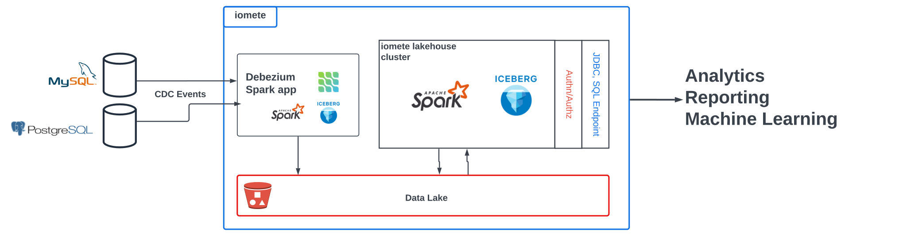
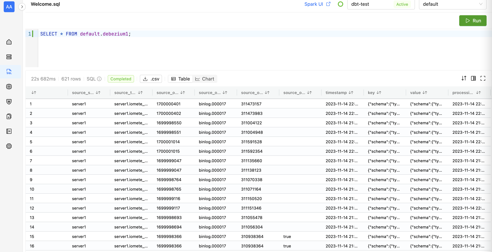

[](http://www.apache.org/licenses/LICENSE-2.0.html)


# Debezium iomete consumers




**Apache Iceberg Consumer Integration with Debezium Server**

This Spark job introduces an Apache Iceberg consumer to the [Debezium Server](https://debezium.io/documentation/reference/operations/debezium-server.html), which is a powerful tool for database change data capture (CDC). The key purpose of this integration is to enable real-time replication of CDC changes from databases to Iceberg tables. This is particularly useful for systems using cloud storage solutions or HDFS.

**Key Features:**

- **Real-Time Database Replication:** The Spark job facilitates the replication of database changes to Iceberg tables in real time. This is essential for systems that rely on up-to-date data for analytics and other operations.

- **Broad Database Compatibility:** The solution supports CDC events from a wide range of databases, including MySQL and PostgreSQL. This broad compatibility makes it a versatile tool for diverse data ecosystems.

- **No Need for Kafka or Other Streaming Platforms:** One of the significant advantages of this Spark job is that it eliminates the need for Kafka or similar streaming platforms for CDC. This simplification can lead to reduced complexity and potentially lower costs.

- **Integration with Iomete Lakehouse:** The application consumes CDC events and integrates with IOMETE lakehouse, which runs Debezium under the hood. This integration ensures seamless data flow and management within the lakehouse architecture.

- **Mini-Batch Consumption:** The consumer is designed to handle CDC events in mini-batches, optimizing the balance between real-time data processing and resource efficiency.

This Spark application thus stands out as an efficient, scalable solution for integrating CDC events into a data lakehouse architecture, particularly for environments already utilizing Apache Iceberg and Debezium Server.


## Functionality of the Spark Job with Standalone Debezium Server

**CDC Event Consumption from RDBMS Databases:**
- This Spark job utilizes the Standalone Debezium Server to capture change data capture (CDC) events from relational database management systems (RDBMS).
- At regular intervals, defined by the batch interval setting in the Spark job configuration, the job aggregates CDC events.

**Writing to Iceberg Tables:**
- The collected CDC events are then written to an Apache Iceberg table.
- If the specified Iceberg table does not exist, it is automatically created by the job.
- By default, this table is partitioned by day, optimizing query performance and data management.

**State Management with Debezium:**
- Alongside the main Iceberg table, a separate table, named `debezium_state_<server.id>`, is also created. This table is crucial for maintaining the state of the Debezium server.
- It stores committed log file positions (offsets) and a history of the database schema as tracked by Debezium.
- This state management ensures that if the Spark job is restarted, it will resume from the last committed position. This feature eliminates the need to reprocess database schema history, thereby saving time and computational resources.

The destination table will have the following schema:
```
+-------------------------------+----------------------------------------------------+----------+
|           col_name            |                     data_type                      | comment  |
+-------------------------------+----------------------------------------------------+----------+
| source_server                 | string                                             |          |
| source_topic                  | string                                             |          |
| source_offset_ts_sec          | bigint                                             |          |
| source_offset_file            | string                                             |          |
| source_offset_pos             | bigint                                             |          |
| source_offset_snapshot        | boolean                                            |          |
| timestamp                     | timestamp                                          |          |
| key                           | string                                             |          |
| value                         | string                                             |          |
| processing_time               | timestamp                                          |          |
|                               |                                                    |          |
| # Partitioning                |                                                    |          |
| Part 0                        | days(processing_time)                              |          |
|                               |                                                    |          |
| # Metadata Columns            |                                                    |          |
| _spec_id                      | int                                                |          |
| _partition                    | struct<processing_time_day:date>                   |          |
| _file                         | string                                             |          |
| _pos                          | bigint                                             |          |
| _deleted                      | boolean                                            |          |
|                               |                                                    |          |
| # Detailed Table Information  |                                                    |          |
| Name                          | spark_catalog.default.debezium1                    |          |
| Location                      | s3a://lakehouse/data/default/debezium1             |          |
| Provider                      | iceberg                                            |          |
+-------------------------------+----------------------------------------------------+----------+
```

And the Iceberg table content will look like this:


## Deployment to IOMETE

### Spark Job creation

- Go to `Spark Jobs` in IOMETE Console.
- Click on `Create New`.

Specify the following parameters (these are examples, you can change them based on your preference):
- **Name:** `debezium-sync`
- **Docker Image:** `iomete/debezium-iceberg-sync-job:1.1.0-latest`
- **Main application file:** `spark-internal`
- **Main class:** `io.debezium.server.Main`
- **Java options:** `-Dlog4j.configurationFile=/etc/configs/log4j2.properties` (optional - specify logging configuration file)
- **Config file:** `/app/application.properties`
```properties
# A numeric ID of this database client, which must be unique across all currently-running database processes in the MySQL cluster.
# This connector joins the MySQL database cluster as another server (with this unique ID) so it can read the binlog.
debezium.source.database.server.id=184057
# database.server.name: Logical name that identifies and provides a namespace for the particular MySQL database server/cluster
# in which Debezium is capturing changes. The logical name should be unique across all other connectors.
# Only alphanumeric characters, hyphens, dots and underscores must be used in the database server logical name.
debezium.source.database.server.name=mysql-iomete-cdc

debezium.source.connector.class=io.debezium.connector.mysql.MySqlConnector
debezium.source.database.hostname=mysql.dp
debezium.source.database.port=3306
debezium.source.database.user=root
debezium.source.database.password=****
debezium.source.database.include.list=iomete_iceberg_db

# IOMETE Sink
debezium.sink.iomete.destination.database=default
debezium.sink.iomete.destination.table=debezium1

# batch CDC events per 10 minutes bases
debezium.sink.batch.batch-size-wait.max-wait-ms=600000
```

> Note: This is an example configuration for MySQL. You can change the configuration based on your database type and other requirements.

Once the Spark job is created, you can start it by clicking on the `Start` button. You can also stop the job by clicking on the `Stop` button.

